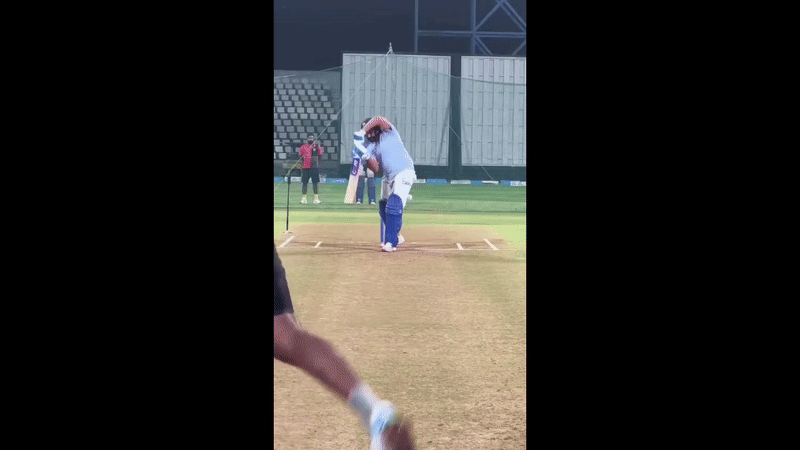
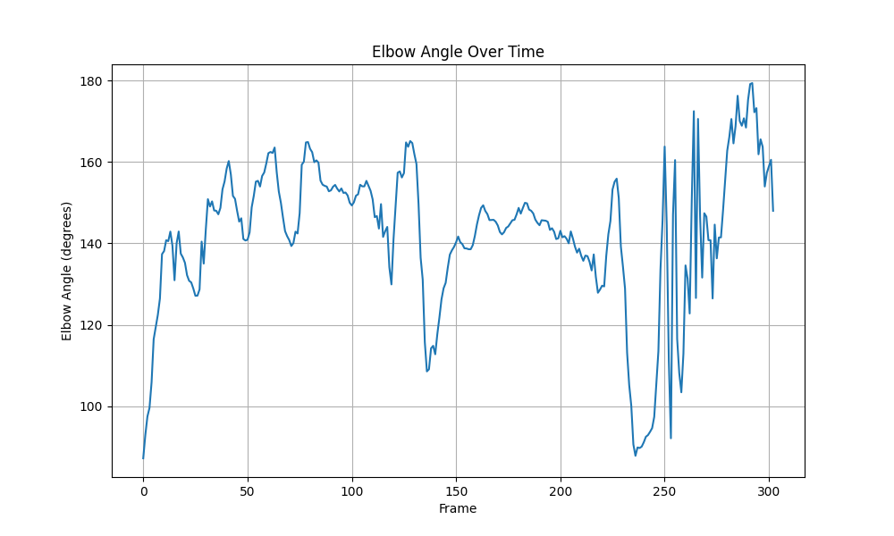

# AI-Powered Cricket Analytics

AthleteRise is a Python-based system for real-time cricket shot analysis (currently focused on the cover drive). It processes full videos frame by frame, applies pose estimation, computes biomechanical metrics, and generates annotated videos with actionable feedback.

## Core

These scripts form the main pipeline of the analysis:

main.py – Entry point for running the analysis.

video_processing.py – Handles input video processing.

pose_estimation.py – Extracts keypoints using MediaPipe/OpenPose.

biomechanical_metrics.py – Computes elbow angle, spine lean, etc.

overlay_utils.py – Adds overlays (skeleton + live metrics).

evaluation.py – Final shot evaluation logic.

config.py – Central configuration file.


## Scope & Requirements

### Base Requirements

*  These provide useful additions on top of the core pipeline:
*   Video input/output management.
*   Compute and display at least three biomechanical metrics in real-time.
*   Simple plotting utilities (e.g., elbow angle over time).
*   Report generation (report_template.html).
*   Configurable parameters for experiments.

### Bonus Features (Advanced Extensions)

This project also aims to implement the following advanced features:

*   **These are experimental/advanced modules to extend the analysis:
*   **streamlit_app.py – Web interface for interactive uploads.**
*   skill_grade_prediction.py – Predict player skill level.
*   temporal_smoothness.py – Smooth noisy keypoints.
*   report_export.py / new_report_export.py – Export reports in custom formats.
*   robustness_ux.py – Improve usability and error handling.
*   performance_target.py – Compare metrics with expert benchmarks.
*  bat_tracking.py – Track bat position..

## Deliverables

*   `app.py`: The Streamlit web app.
*   `cover_drive_analysis_realtime.py`: The main Python script for the analysis.
*   `/output/`: A directory containing the output files:
    *   `annotated_video.mp4`: The annotated video with overlays.
    *   `evaluation.json`: The final evaluation report.
*   `requirements.txt`: A list of required Python packages.
*   `README.md`: This file.

## Setup & Run Instructions

1. **Set up Python 3.10 environment (recommended):**
   This project was developed and tested on **Python 3.10**.  
   It is highly recommended to use a virtual environment with Python 3.10 to avoid compatibility issues.  

   ```bash
   # If you use conda
   conda create -n cricket_analytics python=3.10
   conda activate cricket_analytics

   # If you use venv
   python3.10 -m venv cricket_analytics
   source cricket_analytics/bin/activate  # On Windows: cricket_analytics\Scripts\activate
   
2.  **Clone the repository:**
    ```bash
       [https://github.com/vijayyh/cricket_cover_drive_analysis.git]
    ```
3.  **Install the dependencies:**
    ```bash
    pip install -r requirements.txt
    ```
4.  **Run the Streamlit app:**
    ```bash
    streamlit run app.py
    ```
    OR 
    ```bash
    python cover_drive_analysis_realtime.py
    ```
5.  **Open your web browser** and go to the URL provided by Streamlit.
6.  **Upload a video** of a cover drive and wait for the analysis to complete both are available in the repository.
7.  **View the results** and download the annotated video and evaluation report.

## Example

Below is a real example from this repo. You can play the input and annotated GIFs right here, and open the reports with one click.

---

### Input Videos

### Prithvi Shaw Cover Drive


### Rohit Sharma Cover Drive

---

### Output: Annotated Videos


### Output: Temporal Smoothness



---


## Assumptions & Limitations

Focused on cover drive analysis (extendable to other shots).

Works best with clear, single-player cricket footage.

Bat tracking and ball contact detection are optional bonus features.

Evaluation metrics are based on general cricketing principles.

## Tech Stack

*   **Python:** The core programming language.
*   **OpenCV:** For video processing and analysis.
*   **MediaPipe:** For pose estimation.
*   **Streamlit:** For the web-based user interface.
*   **scikit-learn:** For machine learning tasks (e.g., skill grade prediction).
*   **NumPy:** For numerical computations.
